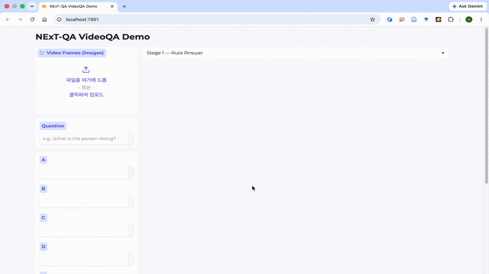

<div align="center">
<h1> VideoQA with visual prompting </h1>



</div>

This repository provides an interactive NextQA demo for VideoQA with uncertainty-aware visual prompting.
It is designed to let a user enter a VideoQA question, generate visual prompted keyframes through a keyframe selection module and a mask generation module, and then run LMM inference to produce both an answer and an uncertainty score.
If the uncertainty suggests that the prediction should be revisited, the user can intervene at the mask generation stage, regenerate the visual prompts with a human-selected mask, and run inference again to obtain the final result.
The demo uses RGA3 for question answering and SAM2 for grounding and mask prediction.

## Environment

We recommend using the Docker image `hushon/rga3` for the demo and environment setup.
After entering the Docker container, activate the conda environment with `conda activate rga3` before running the demo.

```bash
apt update && apt install openjdk-11-jdk -y && apt install zip
```

**Trouble Shooting**:
Since we adopt an early version of Qwen2.5-VL (4.49.0.dev0 for HuggingFace), some bfloat16 problems should be manually addressed, according to this [issue](https://github.com/QwenLM/Qwen2.5-VL/issues/706).


## Demo

After downloading checkpoints & installing environments, you can open an interface to inference via Gradio.

```bash
python app.py --version /PATH/TO/UniGR-7B
```


## Prepare Datasets

You can check the used training datasets and the corresponding sampling rate in `run_torchrun.sh` and `utils/dataset.py`.

- For image segmentation datasets, please refer to [LISA](https://github.com/dvlab-research/LISA/tree/main?tab=readme-ov-file#training-data-preparation).
- For video segmentation datasets, please refer to [VideoLISA](https://github.com/showlab/VideoLISA/blob/main/README.md#prepare-data-for-training) & [ReVOS](https://github.com/cilinyan/ReVOS-api).
- For region-level image question-answering datasets, please refer to [ViP-LLaVA](https://github.com/WisconsinAIVision/ViP-LLaVA?tab=readme-ov-file#visual-instruction-tuning) & [Osprey](https://github.com/CircleRadon/Osprey?tab=readme-ov-file#dataset-).
- For region-level video question-answering datasets, you can download from [VideoInfer](https://www.dropbox.com/scl/fo/9mcd1yrf8ca8b5heziqz4/AKfHt8pYjPvi0_kQUk8hx9o?rlkey=e7p4d0v3e2zuih7rbsuynrmd0&st=nqd8bhym&dl=0) & [VideoRefer-Bench](https://github.com/DAMO-NLP-SG/VideoRefer?tab=readme-ov-file#%EF%B8%8F-videorefer-bench).
- For general question-answering datasets, you can download from [LLaVA](https://github.com/haotian-liu/LLaVA/blob/main/docs/Data.md) & [LLaVA-Video](https://huggingface.co/datasets/lmms-lab/LLaVA-Video-178K).

You should replace the absolute path in the code with the actual saved path on your machine.


### VideoInfer Structure

The train/test spliting of [VideoInfer](https://www.dropbox.com/scl/fo/9mcd1yrf8ca8b5heziqz4/AKfHt8pYjPvi0_kQUk8hx9o?rlkey=e7p4d0v3e2zuih7rbsuynrmd0&st=nqd8bhym&dl=0) follows ReVOS to avoid data leakage between segmentation and question-answering.

```bash
VideoInfer-Release
├── frames                        # all images of the train set and test set
├── visual_prompts                # fixed visual prompts for the test set
├── mask_dict.json                # mask dict (train set & test set)
├── train.json                    # QA pairs & masks for generating visual prompts (train set)
└── test.json                     # QA pairs & fixed visual prompts (test set)
```


## Training

Our original training is conducted on 8xH800 (80G) of 2 nodes for about 1 day.

```bash
bash run_torchrun.sh
```

After training, you should merge LoRA weights:

```bash
bash merge.sh
```


## Evaluation

You can check the details of each benchmark in the `evaluation` folder. Before executing the inference and evaluation commands, you may change the codes with the actual dataset paths.

### Video Segmentation

For example, when evaluating on MeViS, you should
```bash
cd RGA3-release

# Step 1
bash evaluation/mevis_val_u/run_inference_mevis.sh

# Step 2
bash evaluation/mevis_val_u/run_eval_mevis.sh
```

**Trouble Shooting**:
The inference script we adopted from VideoLISA may skip some samples, so you may need to execute Step 1 more than once before executing Step 2.

### VideoRefer-Bench<sup>Q</sup>

To evaluate RGA3 on VideoRefer-Bench<sup>Q</sup>, execute following command and the calculated accuracy will be printed.

```bash
bash evaluation/videorefer_bench/run_inference_videorefer.sh
```


### VideoInfer

To evaluate RGA3 on the VideoInfer test split, you should execute the following commands:

```bash
bash evaluation/videoinfer/run_inference_parallel.sh
```
This step will conduct inference and offline metric calculation, such as BLEU-4, saving predicted answers and ground truth answers. Afterwards, to obtain GPT4 accuracy/score, you can refer to `eval_gpt.ipynb`, where we implement the evaluation through OpenAI batch inference. However, you can re-implement it while keeping the original prompt and model version according to your API provider.

We also provide the evaluation scripts of several baseline methods in the `baselines` folder.


## Citation

If you find this paper or repo helpful, you can use the following format to cite:
```bibtex
@article{wang2025object,
  title={Object-centric Video Question Answering with Visual Grounding and Referring},
  author={Wang, Haochen and Chen, Qirui and Yan, Cilin and Cai, Jiayin and Jiang, Xiaolong and Hu, Yao and Xie, Weidi and Gavves, Stratis},
  journal={arXiv preprint arXiv:2507.19599},
  year={2025}
}
```


## 🫡 Acknowledgements

- Our codes are based on [LISA](https://github.com/dvlab-research/LISA/) & [VideoLISA](https://github.com/showlab/VideoLISA/). The copyright for adding language embedding in SAM2 belongs to [Sa2VA](https://github.com/magic-research/Sa2VA). The implementation of generating and processing visual prompts is based on [ViP-LLaVA](https://github.com/WisconsinAIVision/ViP-LLaVA).

- We also thank the open-source projects like [Qwen2.5-VL](https://github.com/QwenLM/Qwen2.5-VL), [CoTracker3](https://github.com/facebookresearch/co-tracker) and [SAM2](https://github.com/facebookresearch/sam2).
